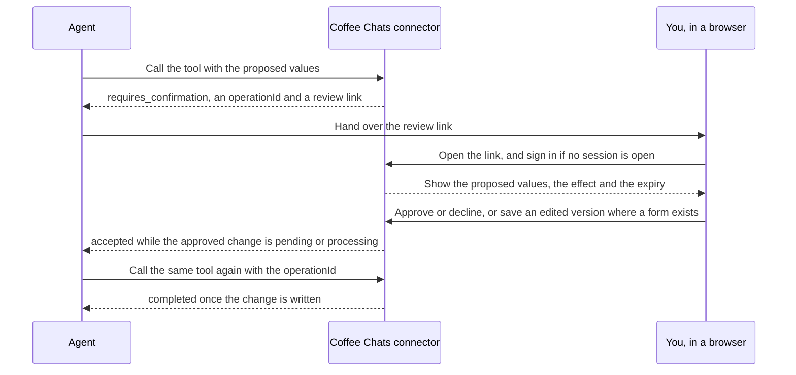

Fifteen of the 59 tools change something. Ten of them write as soon as the agent calls them. Five of them write nothing until you approve the change in your browser. After reading this page you will know which changes fall on which side, why the line is drawn there, what every write result looks like, and what happens between an agent's proposal and the moment something is written.

## The line between the two

A change is a safe write when it affects only your own account and you can set it back yourself from a screen in the app. A change is consequential when it alters what other people see or what they can book.

| | Safe write | Needs your approval |
| --- | --- | --- |
| How many tools | 10 | 5 |
| Risk class in the catalogue | `safe_write` | `consequential` |
| When it is written | As soon as the agent calls the tool | Only after you approve it in a browser |
| What it touches | Your own settings and your own records | Your public booking page and its event types |
| How you undo it | Change it back in the app | Change it back in the app |

The ten safe writes cover your profile preferences, your job-search stage, the notes and tags on a contact, the notes and outcome on a meeting, a campaign's name, description and goal, a campaign's sending state, an internship application's stage and priority, and the withdrawal of a review request you have not decided yet.

The five that need your approval are all about your booking page: its text, whether it is public, its scheduling rules, the details of one event type, and whether one event type is archived.

## Why an idempotency key

Fourteen of the fifteen write tools take an `idempotencyKey`, a string of 16 to 128 characters that the agent chooses for one particular change. It is how Coffee Chats recognises a repeat of a call it has already seen.

- Send the same tool, the same key and the same input again, and Coffee Chats returns the answer it already computed. Nothing is written twice. That is what makes a retry safe after a lost answer.
- Send the same key with different input, and the call is refused with `VERSION_CONFLICT`. A key names one change, and it cannot be pointed at a different one.
- A genuinely new change needs a new key. Reusing an old key to force a retry returns the old answer.

A stored change is made unique by the connection, the tool name and the key together, so the same key sent to two different tools names two different changes and neither can overwrite the other.

The fifteenth write tool is `actions.cancel`, which withdraws a review request. Its whole input is `operationId`, and it takes no idempotency key at all, because the identifier of the review request it withdraws already names one thing. Sending it a key is refused before the tool runs.

## The result object

Every write tool answers with one structured object rather than free text. This section is the one description of that object, and every example on every page matches it.

The object arrives under `structuredContent` in the tool response. The same JSON is repeated as text in the response's `content` array, so an agent host that reads only text still sees it. A completed safe write looks like this in full:

```json Completed write result
{
  "structuredContent": {
    "tag": "completed",
    "scenario": "success",
    "operationId": "0123456789abcdef01234567",
    "operationStatus": "succeeded",
    "result": { "summary": "Contact notes updated", "itemCount": 1 }
  },
  "content": [{ "type": "text", "text": "the same object, as a JSON string" }]
}
```

The examples on the rest of these pages print the inner object on its own, because that is the part an agent branches on. Every one of them sits under `structuredContent` on the wire.

### Read `tag` first, then `status`

A write result carries either a `tag` field or a `status` field. It never carries both. Branch on `tag` when it is there, and on `status` when it is not.

| Discriminator | Values a write tool sends | What that group means |
| --- | --- | --- |
| `tag` | `requires_confirmation`, `accepted`, `completed` | The call is still going somewhere, or it finished by writing. |
| `status` | `failed`, `cancelled`, `uncertain` | The call is over and nothing was written, or nothing can be proved. |

Two contracts meet here, which is why there are two field names. The result format is the union of the contract for a tool call and the contract for reading the state of one change. The first is keyed on `tag`, the second on `status`, and a write tool answers on whichever of the two fits the state it is reporting.

### Every field

| Field | Type | When it is present | What it means |
| --- | --- | --- | --- |
| `tag` | string | On a `requires_confirmation`, `accepted` or `completed` result | The outcome group. Branch on this first. |
| `status` | string | On a `failed`, `cancelled` or `uncertain` result | The outcome group, when there is no `tag`. |
| `scenario` | string | Always | A narrower label for the same outcome. It is informational. |
| `operationId` | string | Always | Names this one change. |
| `operationStatus` | string | With `tag` of `accepted` or `completed` | `pending` or `processing` beside `accepted`, and `succeeded` beside `completed`. |
| `actionStatus` | string | With `tag` of `requires_confirmation` | Always `pending_approval`. |
| `handoff` | object | With `tag` of `requires_confirmation` | `kind` is `action_review` and `url` is the review link. |
| `result` | object | With `tag` of `completed` | `summary`, a sentence of at most 240 characters, and `itemCount`, a whole number. The written value itself is never sent back. |
| `error` | object | With `status` of `failed`, `cancelled` or `uncertain` | `code`, `retryable` and `correlationId`. |

`scenario` is one of eight values on a write result: `success`, `loading`, `conflict`, `denied`, `expired`, `unavailable`, `cancelled` and `uncertain`. The first two appear on results that have not failed. The other six appear on the three groups that `status` reports. The contract also declares `empty`, and no write tool sends it.

### The two identifiers

`operationId` names one change. On a consequential tool it is also the review request identifier, and it is the last part of the review link the tool hands back. To learn what you decided, the agent calls the same tool again and sends that value in the `operationId` field. There is no other field and no other address that carries it.

`correlationId` sits inside the `error` object and identifies the same change in the Coffee Chats logs. On every result the connector produces today it carries the same value as `operationId`. Record it, and include it when reporting a problem to support. It means nothing else to your agent.

Every Coffee Chats identifier is a 24-character hexadecimal string. The examples in these pages use a different one for each kind of record, so `c0ffeec0ffeec0ffee000001` is always a contact and `0123456789abcdef01234567` is always an operation or a review request.

### Shapes the contract allows and no tool sends

The result format is shared by tools that do not exist yet, so it declares more than any tool returns today. The `requires_user_action` tag and the `pending`, `processing` and `succeeded` values of `status` are declared and unused. Do not build against a result shape you have not seen documented for a specific tool. Each tool's page in the [tool reference](/mcp/tools/overview) lists the shapes that tool can return. Report anything else as an unrecognised answer instead of acting on it.

## What each outcome means

| Group | Field and value | What it means | What to do |
| --- | --- | --- | --- |
| Waiting for you | `tag` is `requires_confirmation` | A review request exists and nothing has been written. | Give the student the link in `handoff.url` and poll. |
| Accepted | `tag` is `accepted` | The work is under way. Nothing has been written yet. | Poll again. |
| Completed | `tag` is `completed` | The change was written, exactly once. | Stop. Read the value back if you need to show it. |
| Failed | `status` is `failed` | Nothing was written. `error.code` says why. | Follow the action in [error codes](/mcp/errors). |
| Cancelled | `status` is `cancelled` | The review request was withdrawn before the change started, so nothing was written. | Stop. |
| Uncertain | `status` is `uncertain` | Coffee Chats cannot prove whether the change landed, and says so rather than guessing. | Read the stored value. [Settle an uncertain result](/mcp/guides/settle-an-uncertain-result) is the procedure. |

An accepted result and an uncertain result are easy to confuse. Accepted means the work is still running, so poll again. Uncertain means the work is over and Coffee Chats cannot say what it did, so polling will never resolve it.

## How to poll

To poll a safe write, call the same tool again with the same idempotency key and the same input. The answer is the current state of that change. Nothing is written a second time.

To poll a consequential tool, call the same tool again and send only `operationId`, set to the value the first call returned. That input shape takes no other property.

In both cases, stop when the result is `completed`, `failed`, `cancelled` or `uncertain`, which are the four states nothing moves out of.

<Warning>
Poll at a human pace. The student has to open a link, read a page and press a button. The connector allows 120 agent calls a minute on one connection, and a tight polling loop spends that budget on one waiting change and locks the agent out of its own reads.
</Warning>

## The flow of one approval

A consequential tool never writes on its first call. It creates a review request, hands back a link, and waits. The agent finds out what happened by calling the same tool again with `operationId`. There is no separate status endpoint. An agent can never approve its own review request.



An existing Coffee Chats session skips the sign-in step. An edit form exists only on booking page text, on scheduling rules and on event type details. The visibility and archive reviews have no edit form, because each of those carries a value with only two states.

A review request waits thirty minutes from the moment it is made. After that it expires and nothing is written. Editing the values does not extend that deadline: an edit creates a new version of the same review request, under the same identifier, and that version still needs approving.

[Approvals](/mcp/approvals) describes what the review page shows you and how each review request can end.

## The retry hint

A write can be accepted and still ask the agent to come back later. When that happens the answer is an accepted result with a hint beside it, under `_meta` rather than inside the result. The hint holds a code, the fixed value `true` for `retryable`, and a delay in milliseconds. Nothing has gone wrong and nothing has been written yet. The two codes a hint can carry are `PERMIT_BACKPRESSURE` and `PERMIT_CONTENTION`, and both mean the same thing to a caller: wait for the stated delay and call again with the same idempotency key.

The delay is at least 1 millisecond and at most 5,000, and both write paths that issue one today ask for 1,000.

<Warning>
Do not treat a retry hint as a failure. The change has been accepted and will proceed. If your agent stops here, it reports a failure for work that was going to succeed.
</Warning>

## Next steps

<CardGroup cols="2">
  <Card title="Approvals" href="/mcp/approvals">
    What the review page shows, and the nine states a review request can be in.
  </Card>
  <Card title="Update a preference safely" href="/mcp/guides/update-a-preference">
    One safe write worked through, with its replay and its conflict.
  </Card>
  <Card title="Propose a booking page change" href="/mcp/guides/propose-a-booking-page-change">
    The agent's side of one approval, end to end.
  </Card>
  <Card title="Error codes" href="/mcp/errors">
    Every code a write can return, its cause and the action to take.
  </Card>
</CardGroup>
