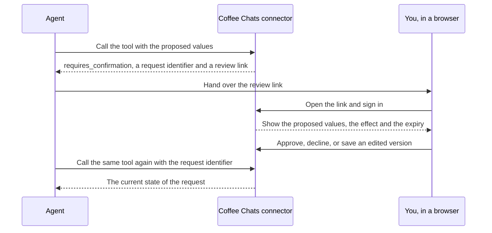

Fifteen of the 59 tools change something. Ten of them write as soon as the agent calls them. Five of them write nothing until you approve the change in your browser. After reading this page you will know which changes fall on which side, why the line is drawn there, and what happens between an agent's proposal and the moment something is written.

## The line between the two

A change is a safe write when it affects only your own account and you can set it back yourself from a screen in the app. A change is consequential when it alters what other people see or what they can book.

| | Safe write | Needs your approval |
| --- | --- | --- |
| How many tools | 10 | 5 |
| Risk class in the catalogue | `safe_write` | `consequential` |
| When it is written | As soon as the agent calls the tool | Only after you approve it in a browser |
| What it touches | Your own settings and your own records | Your public booking page and its event types |
| How you undo it | Change it back in the app | Change it back in the app |

The ten safe writes cover your profile preferences, your job-search stage, the notes and tags on a contact, the notes and outcome on a meeting, a campaign's name, description and goal, a campaign's sending state, an internship application's stage and priority, and the withdrawal of a request you have not decided yet.

The five that need your approval are all about your booking page: its text, whether it is public, its scheduling rules, the details of one event type, and whether one event type is archived.

## Why an idempotency key

Fourteen of the fifteen write tools take an `idempotencyKey`, a string of 16 to 128 characters that the agent chooses for one particular change. It is how Coffee Chats recognises a repeat of a call it has already seen.

- Send the same tool, the same key and the same input again, and Coffee Chats returns the answer it already computed. Nothing is written twice. That is what makes a retry safe after a lost answer.
- Send the same key with different input, and the call is refused with `VERSION_CONFLICT`. A key names one change, and it cannot be pointed at a different one.
- A genuinely new change needs a new key. Reusing an old key to force a retry returns the old answer.

A stored change is made unique by the connection, the tool name and the key together, so the same key sent to two different tools names two different changes and neither can overwrite the other.

The fifteenth write tool is `actions.cancel`, which withdraws a request. It takes no key, because the identifier of the request it withdraws already names one thing.

## The flow of one approval

A consequential tool never writes on its first call. It creates a request, hands back a link, and waits. The agent finds out what happened by calling the same tool again with the same request identifier. There is no separate status address, and an agent cannot approve its own request.

A request waits thirty minutes from the moment it is made. After that it expires and nothing is written. Editing the values does not extend that deadline: an edit creates a new version of the same request, under the same identifier, and that version still needs approving.

[Approvals](/mcp/approvals) describes what the review page shows you and how each request can end.

## What a write result tells you

A safe write answers with a structured result rather than free text, and so does a consequential tool once you have decided. Five outcomes can arrive, and an agent has to tell them apart.

| Outcome | What it means |
| --- | --- |
| Accepted | The work is under way. Nothing has been written yet. Keep polling. |
| Completed | The change was written, exactly once. |
| Failed | Nothing was written. The result carries a code saying why. |
| Cancelled | The request was withdrawn before the change started, so nothing was written. |
| Uncertain | Coffee Chats cannot prove whether the change landed, and says so rather than guessing. |

An accepted result and an uncertain result look similar and are opposites. Accepted means the work is still happening. Uncertain means the work is over and the answer is unavailable, and polling will not turn it into a yes or a no. [Settle an uncertain result](/mcp/guides/settle-an-uncertain-result) is the procedure for the second one.

## The retry hint

A write can be accepted and still ask the agent to come back later. When that happens the answer is an accepted result with a hint beside it holding a code and a delay in milliseconds. Nothing has gone wrong and nothing has been written yet. The two codes a hint can carry are `PERMIT_BACKPRESSURE` and `PERMIT_CONTENTION`, and both mean the same thing to a caller: wait for the stated delay and call again with the same idempotency key.

<Warning>
An agent that reads a retry hint as a failure and gives up abandons work that was going to happen.
</Warning>

## Next steps

<CardGroup cols="2">
  <Card title="Approvals" href="/mcp/approvals">
    What the review page shows, and the nine states a request can be in.
  </Card>
  <Card title="Update a preference safely" href="/mcp/guides/update-a-preference">
    One safe write worked through, with its replay and its conflict.
  </Card>
  <Card title="Propose a booking page change" href="/mcp/guides/propose-a-booking-page-change">
    The agent's side of one approval, end to end.
  </Card>
  <Card title="Error codes" href="/mcp/errors">
    Every code a write can return, its cause and the action to take.
  </Card>
</CardGroup>
